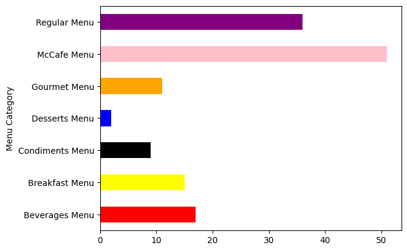
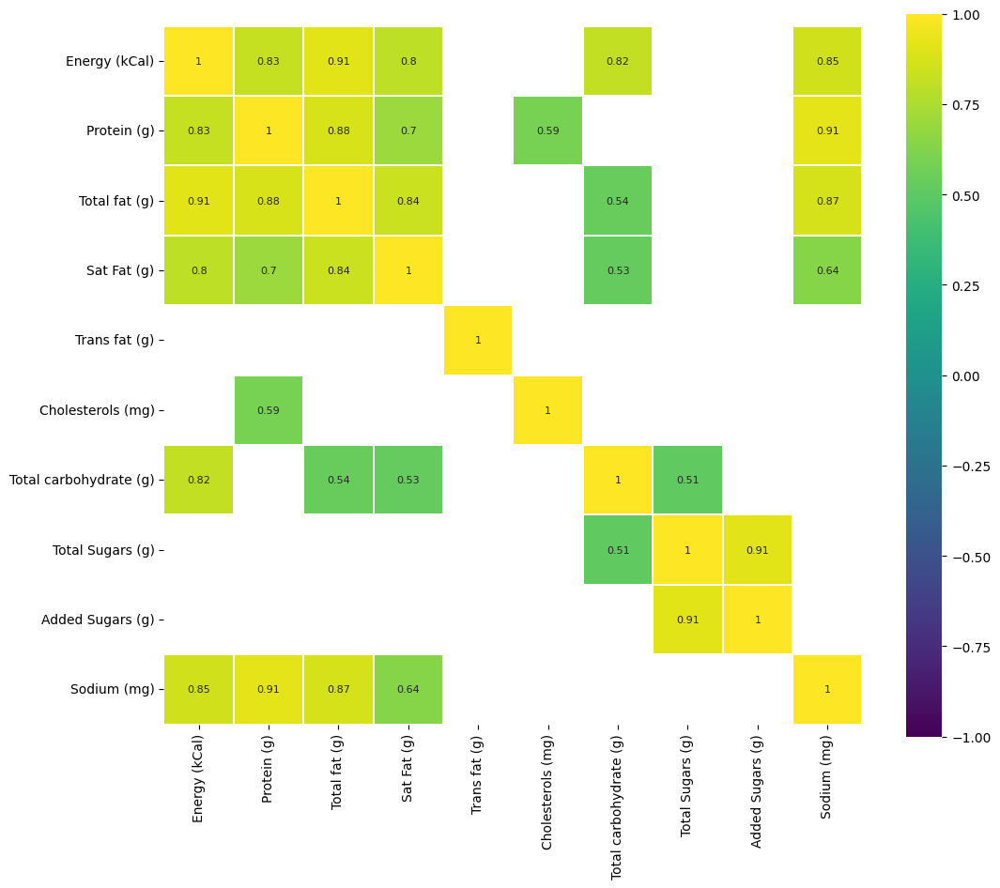
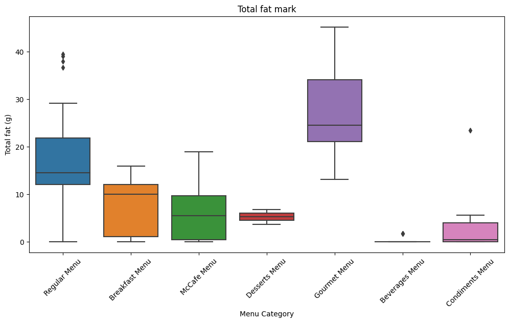
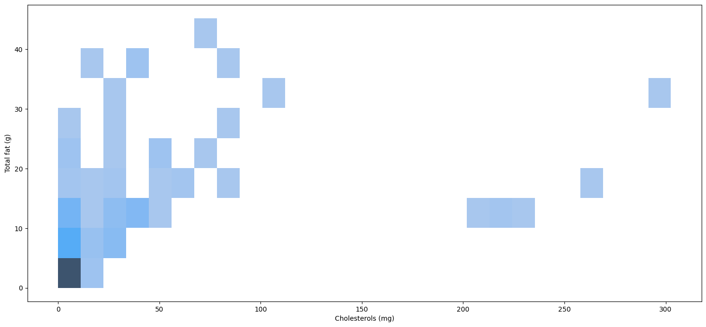
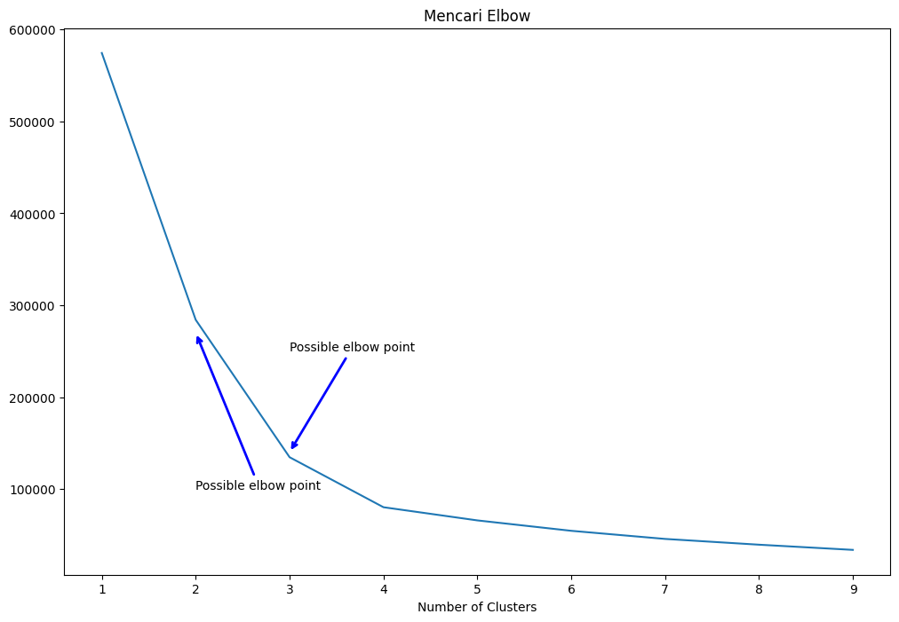
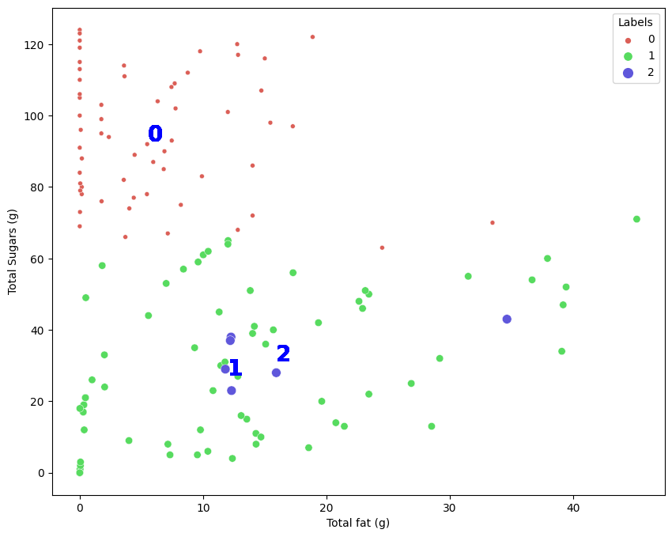
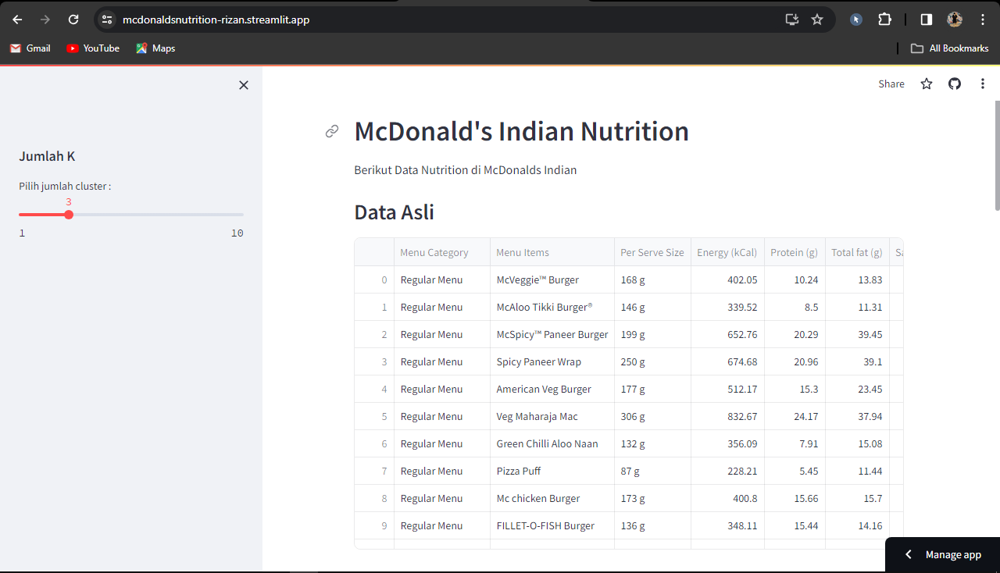

# Laporan Proyek UAS Machine Learning
### Nama : Rizan Fauzi Rahman
### Nim : 211351129
### Kelas : Pagi B

## Domain Proyek
Proyek ini bertujuan untuk mengidentifikasi data McDonald's Nutrition dan mengelompokan mengunakan algoritma clustering segmentasi, juga untuk mengidentifikasi dan memahami kelompok-kelompok berdasarkan karakteristik tertentu. 

## Business Understanding
Proyek ini berfokus untuk mengidentifikasi dan memahami kelompok-kelompok berdasarkan karakteristik tertentu.

### Problem Statements
Mengidentifikasi pengelompokan Nutrition di McDonals Indian.

### Goals
Tujuan ini mungkin untuk mengelompokan Nutrition dari data Total Sugars dan Total fat dengan algoritma clustering segmentasi.

 ### Solution statements
 Penting untuk merinci dan menyesuaikan Problem Statement yang akan membantu Anda memandu   mengelompokan secara otomatis menggunakan K-Means Clustering..

 ## Data Understanding
Dataset yang saya gunakan berasal jadi Kaggle dan Kumpulan data ini memberikan analisis nutrisi setiap item menu di menu McDonald's India.

 https://www.kaggle.com/datasets/deepcontractor/mcdonalds-india-menu-nutrition-facts

 ### Variabel-variabel pada Heart Failure Prediction Dataset adalah sebagai berikut:
1. Menu Category (Kategori Menu) = object
2. Menu Items (Item Menu) = object
3. Per Serve Size (Per Ukuran Penyajian) = object
4. Energy (Energi) = float64
5. Protein (Protein) = float64t 
6. Total fat (Total Lemak) = ofloat64 
7. Sat Fat (Gemuk) = float64  
8. Trans fat (Lemak trans) = float64
9. Cholesterols (Kolesterol) = float64
10. Total carbohydrate (Jumlah karbohidrat) = float64
11. Total Sugars (Jumlah Gula) = float64
12. Added Sugars (Menambahkan Gula) = float64
13. Sodium = float64

## Data Preparation
## Data Collection
Data ini merupakan koleksi informasi yang berharga dan mencangkup nutrisi setiap item menu di menu McDonald's India.Untuk data collection ini, saya mendapatkan dataset yang nantinya digunakan dari website kaggle.

## Data Discovery And Profiling
### import library yang digunakan
Pertama tama kita harus menginport Library-library yang dibutuhkan
``` bash
import pandas as pd
import numpy as np
import matplotlib.pyplot as plt
import seaborn as sns
from sklearn.cluster import KMeans
from sklearn.preprocessing import StandardScaler
from sklearn.cluster import KMeans
from sklearn.metrics import silhouette_score
from sklearn.datasets import make_blobs
```
### import Dataset
Upload Token yang telah didownload di kaggel
``` bash
from google.colab import files
files.upload()
```

Selanjunya membuat sebuah folder untuk menyimpan file kaggle.json yang tadi telah didownload
```bash
!mkdir -p ~/.kaggle
!cp kaggle.json ~/.kaggle/
!chmod 600 ~/.kaggle/kaggle.json
!ls ~/.kaggle
```
Selanjutnya kita Download Datasetsnya
```bash
!kaggle datasets download -d deepcontractor/mcdonalds-india-menu-nutrition-facts --force
```

Selanjutnya exstract file yang telah didownload
```bash
!mkdir mcdonalds-india-menu-nutrition-facts
!unzip mcdonalds-india-menu-nutrition-facts.zip -d mcdonalds-india-menu-nutrition-facts
!ls mcdonalds-india-menu-nutrition-facts
```
### Data Discovery
Lanjut dengan memasukan dataset dan untuk melihat data-data diurutan 5 paling atas dari Datasetsnya
``` bash
df = pd.read_csv('/content/mcdonalds-india-menu-nutrition-facts/India_Menu.csv')
```
```bash
df.head()
```

Melihat tipe data yang digunakan
``` bash
df.info()
```
```bash
df.isnull().sum()
```

Untuk Cek detail informasi dari dataset
``` bash
df.describe()
```
### EDA

memvisualisasikan distribusi jumlah data kategori 'Menu Category' :
```bash
c = ['red', 'yellow', 'black', 'blue', 'orange','pink','purple']
df.groupby('Menu Category')['Menu Category'].count().plot.barh(color=c);
```
 <br>

Berikut matriks korelasi antar fitur :
``` bash
corr = df.drop(['Menu Category', 'Menu Items'], axis=1).corr() # We already examined SalePrice correlations
plt.figure(figsize=(12, 10))

sns.heatmap(corr[(corr >= 0.5) | (corr <= -0.4)], cmap='viridis', vmax=1.0, vmin=-1.0, linewidths=0.1,annot=True, annot_kws={"size": 8}, square=True);
```
 <br>

Berikut membuat boxplot yang memvisualisasikan distribusi total lemak dalam berbagai kategori menu:
```bash
plt.figure(figsize = (12, 6))
ax = sns.boxplot(x='Menu Category', y='Total fat (g)', data=df)
plt.setp(ax.artists, alpha=.5, linewidth=2, edgecolor="k")
plt.xticks(rotation=45)
plt.title('Total fat mark')
```
 <br>

Lanjut membuat plot garis yang menunjukkan hubungan antara "Total fat (g)" dan "Sodium (mg)" :
```bash
plt.figure(figsize=(18,8))
plt5 = sns.lineplot(x="Total fat (g)", data=df,y="Sodium (mg)",hue="Menu Category")
plt.show()
```
 <br>

Berikut membuat sebuah histogram plot dengan menggunakan Seaborn, menampilkan distribusi data antara "Cholesterols (mg)" dan "Total fat (g)" :
```bash
plt.figure(figsize=(18,8))
plt4 = sns.histplot(x="Cholesterols (mg)", y="Total fat (g)", data=df)
plt.show()
```
 <br>

### Preprocessing

Kita akan mengubah nilai pada kolom 'Total Sugars (g)' dalam DataFrame (df) menjadi nilai numerik..
``` bash
le=LabelEncoder()
df['Total Sugars (g)']=le.fit_transform(df['Total Sugars (g)'])
```
Selanjutnya kita akan menghapus kolom-kolom tertentu
```bash
X = df.drop(['Menu Category', 'Menu Items', 'Per Serve Size', 'Energy (kCal)', 'Sat Fat (g)', 'Trans fat (g)', 'Total carbohydrate (g)', 'Added Sugars (g)', 'Sodium (mg)'], axis=1)
```
```bash
print(X)
```

### modeling

Kita akan mencari titik elbow dari fitur
```bash
clusters = []
for i in range(1, 10):
    km = KMeans(n_clusters=i).fit(X)
    clusters.append(km.inertia_)

fig, ax = plt.subplots(figsize=(12, 8))
sns.lineplot(x=list(range(1, 10)), y=clusters, ax=ax)
ax.set_title('Mencari Elbow')
ax.set_xlabel('Number of Clusters')

ax.annotate('Possible elbow point', xy=(2, 270000), xytext=(2, 100000), xycoords='data',
            arrowprops=dict(arrowstyle='->', connectionstyle='arc3', color='blue', lw=2))

ax.annotate('Possible elbow point', xy=(3, 140000), xytext=(3, 250000), xycoords='data',
            arrowprops=dict(arrowstyle='->', connectionstyle='arc3', color='blue', lw=2))

plt.show()
```


Selanjutnya memasukan jumlah cluster
``` bash
n_clust = 3
kmean = KMeans(n_clusters=n_clust).fit(X)
X['Labels'] = kmean.labels_
```

Selanjutnya kita akan clustering atau mengelompokan data
```bash
plt.figure(figsize=(10, 8))

sns.scatterplot(x='Total fat (g)', y='Total Sugars (g)', hue='Labels', size='Labels', markers=True, palette=sns.color_palette('hls', n_colors=n_clust), data=X)

for label in X['Labels']:
    plt.annotate(label,
                 (X[X['Labels'] == label]['Total fat (g)'].mean(),
                  X[X['Labels'] == label]['Total Sugars (g)'].mean()),
                 horizontalalignment='center',
                 verticalalignment='center',
                 size=20, weight='bold',
                 color='blue')

plt.show()
```


Kita lihat data yang telah kita clustering
``` bash
print(X)
```

Asumsikan pengelompokan menggunakan KMeans dan Menghitung score silhouette
``` bash
# Assume you have performed clustering using KMeans
kmeans = KMeans(n_clusters=3, random_state=42)
cluster_labels = kmeans.fit_predict(X)

# Calculate silhouette score
silhouette_avg = silhouette_score(X, cluster_labels)
print("Silhouette Score:", silhouette_avg)
```

## Deployment
(https://mcdonaldsnutrition-rizan.streamlit.app/)<br>
